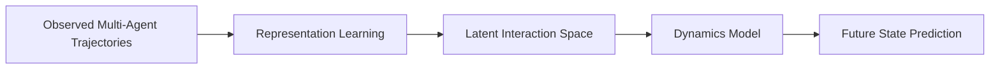

# Latent Space Inference of Dynamic Multi-Agent Systems

A framework for learning and reasoning about the hidden interaction dynamics of multi-agent systems from observed trajectories.

The project explores whether the behaviour of a dynamic multi-agent system can be represented in a learned latent space, allowing the underlying interactions between agents to be inferred from observations and used for future-state prediction.

## Overview

Multi-agent systems are governed by interactions that are often difficult to observe directly. Given a sequence of agent trajectories, this project aims to learn a compact latent representation of those dynamics rather than requiring the interaction structure to be explicitly specified.

At a high level, the system learns the following mapping:



The broader goal is to investigate whether useful structure about a multi-agent system can emerge from trajectory data alone.

## Design Philosophy

### Learn interactions from behaviour

The model should infer useful information about agent interactions from observed trajectories rather than relying on a manually specified interaction graph.

### Separate representation from dynamics

The project separates two problems:

1. learning a representation of the multi-agent system;
2. learning how the system evolves within that representation.

This makes it easier to experiment with different representation-learning and dynamics-modeling approaches independently.

### Model systems, not individual agents

An agent's behaviour is rarely independent of the rest of the system. The model therefore treats trajectories as components of a joint dynamical system rather than isolated time series.

### Keep experimentation modular

The codebase is structured so that models, data generation, training, and evaluation can evolve independently. This makes the repository useful as an experimental framework rather than a single fixed model implementation.

## Project Structure

```text
Latent-Space-Inference-of-Dynamic-Multi-Agent-Systems/
├── ...
```

> Update this section to reflect the current repository structure.

The codebase is broadly organized around:

* **data and simulation** — generating or loading multi-agent trajectories;
* **models** — neural components used to learn representations and system dynamics;
* **training** — optimization and experiment execution;
* **evaluation** — analysis of learned representations and predictive behaviour.

## Getting Started

This project uses [`uv`](https://docs.astral.sh/uv/) for Python environment and dependency management.

### Clone the repository

```bash
git clone https://github.com/Rubotix-AI/Latent-Space-Inference-of-Dynamic-Multi-Agent-Systems.git
cd Latent-Space-Inference-of-Dynamic-Multi-Agent-Systems
```

### Install dependencies

```bash
uv sync
```

### Run the project

```bash
uv run <entry-point>
```

Replace `<entry-point>` with the relevant script or module for the experiment you want to run.

## Research Direction

The project investigates questions such as:

* Can hidden interaction structure be recovered from trajectory data?
* What information emerges in the learned latent space?
* Can latent representations improve future-state prediction?
* How well do learned dynamics generalize to unseen system configurations?
* Can the learned representation capture interactions that change over time?

## Current Status

This project is under active development.

The current focus is on building the core pipeline for:

```text
Trajectory Data
      ↓
Representation Learning
      ↓
Latent System State
      ↓
Dynamics Modeling
      ↓
Prediction and Analysis
```

Future work will focus on evaluating the learned latent representations, comparing modeling approaches, and studying generalization across different multi-agent dynamics.

## Applications

The underlying ideas are relevant to problems involving interacting dynamical systems, including:

* multi-robot systems;
* swarm robotics;
* physical system modeling;
* collective behaviour;
* trajectory forecasting;
* learned world models.

## License

See the repository license for usage and distribution terms.
