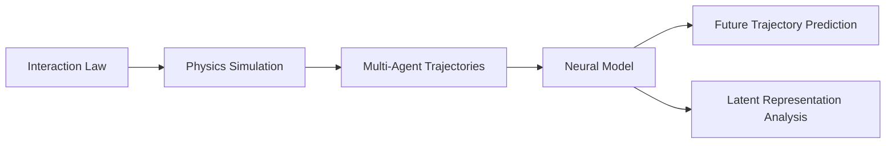
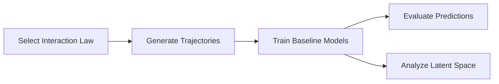

# Latent Space Inference of Dynamic Multi-Agent Systems

A research framework for studying whether neural models can learn meaningful representations of the hidden interaction laws governing dynamic multi-agent systems.

The project generates controlled multi-agent trajectories under different interaction laws, trains multiple neural architectures on the resulting dynamics, and evaluates both **trajectory prediction** and the **structure of the learned latent representations**.

## Overview

Multi-agent systems can exhibit complex collective behaviour despite being governed by relatively simple local interaction rules. Given only the observed trajectories of the agents, can a neural model recover useful information about the dynamics that generated them?

This project investigates that question using a controlled experimental pipeline:



Instead of evaluating models only on predictive accuracy, the project also studies the internal representations learned by different architectures.

The central question is:

> **Do neural models merely learn to predict multi-agent motion, or do their latent spaces encode meaningful information about the underlying interaction dynamics?**

## Design Philosophy

### Controlled dynamics

The project uses a custom simulation framework to generate trajectories from known interaction laws. This provides direct control over the systems being modeled and makes it possible to study how different dynamics are represented by neural networks.

The currently implemented interaction families are:

* Classical Boids
* Leader–Follower
* Predator–Prey
* Spring Networks
* Vicsek Model

Each interaction law is implemented independently with its own configuration and dynamics.

### Architecture comparison

Different model families impose different inductive biases on multi-agent trajectory data. The project currently includes three baselines:

* **LSTM** — models trajectories as temporal sequences.
* **Transformer** — models long-range dependencies through attention.
* **Graph Neural Network** — explicitly models agents and their interactions as a graph.

Rather than assuming one architecture is best suited to the problem, the project provides a common experimental framework for comparing how these models learn both **dynamics** and **representations**.

### Prediction is only part of the evaluation

A model may accurately predict future trajectories without learning a useful or interpretable representation of the underlying system.

The evaluation pipeline therefore considers:

* trajectory prediction error;
* Average Displacement Error (ADE);
* Final Displacement Error (FDE);
* latent-space cluster separation;
* computational runtime;
* qualitative rollout behaviour;
* attention structure;
* latent-space geometry through t-SNE and UMAP.

### Separate simulation, modeling, and evaluation

The codebase separates:

1. **data generation**;
2. **model implementation**;
3. **experiment execution**;
4. **evaluation and visualization**.

This makes it possible to add new interaction laws, architectures, or metrics without restructuring the entire project.

## Project Structure

```text
.
├── documentation/
│
├── experiments/
│   ├── data.py
│   ├── run_experiment.py
│   ├── trainer.py
│   │
│   ├── metrics/
│   │   ├── accuracy_traj_error.py
│   │   ├── ade_fde.py
│   │   ├── latent_cluster_sep.py
│   │   └── time_taken.py
│   │
│   └── visualizations/
│       ├── attention_maps.py
│       ├── rollouts.py
│       ├── t_sne.py
│       └── umap.py
│
├── src/
│   ├── main.py
│   │
│   ├── data/
│   │   ├── metadata/
│   │   └── trajectories/
│   │
│   ├── models/
│   │   ├── baseline_1_lstm.py
│   │   ├── baseline_2_transformer.py
│   │   ├── baseline_3_gnn.py
│   │   └── common.py
│   │
│   └── physics_engine/
│       ├── dataset.py
│       ├── visualize.py
│       │
│       ├── simulation/
│       │   ├── agent.py
│       │   ├── config.py
│       │   ├── factory.py
│       │   ├── interaction.py
│       │   ├── simulation.py
│       │   ├── spring.py
│       │   └── world.py
│       │
│       └── interaction_laws/
│           ├── classical_boids/
│           ├── leader_follower/
│           ├── predator_prey/
│           ├── spring_network/
│           └── vicsek_model/
│
├── results/
├── ORIGIN.py
├── pyproject.toml
├── uv.lock
└── README.md
```

### `src/physics_engine`

The simulation layer of the project.

It defines the agents, world, simulation lifecycle, interaction interface, and dataset-generation pipeline used to produce controlled multi-agent trajectories.

Interaction laws are implemented as independent modules under:

```text
src/physics_engine/interaction_laws/
```

This allows new dynamical systems to be added without modifying the core simulation engine.

### `src/models`

Contains the neural architectures used as experimental baselines:

```text
baseline_1_lstm.py
baseline_2_transformer.py
baseline_3_gnn.py
```

Shared model components are defined in:

```text
common.py
```

### `experiments`

Contains the experiment pipeline used to train and compare models.

```text
data.py            # experiment data handling
trainer.py         # training logic
run_experiment.py  # experiment entry point
```

Metrics and visualizations are kept separate from the training code so that evaluation can evolve independently from model implementation.

### `src/data`

Stores generated trajectory data and associated metadata.

```text
trajectories/
    trajectory_000000.csv

metadata/
    trajectory_000000.json
```

Separating trajectory data from metadata allows each simulation run to retain information about the system that generated it.

### `results`

Stores outputs produced by experiments and analysis.

## Installation

The project uses [uv](https://docs.astral.sh/uv/) for Python dependency and environment management.

Clone the repository:

```bash
git clone https://github.com/Rubotix-AI/Latent-Space-Inference-of-Dynamic-Multi-Agent-Systems.git
cd Latent-Space-Inference-of-Dynamic-Multi-Agent-Systems
```

Install the project dependencies:

```bash
uv sync
```

## Running the Project

Run the main project entry point with:

```bash
uv run python src/main.py
```

Run the experiment pipeline with:

```bash
uv run python experiments/run_experiment.py
```

The exact experiment configuration and available parameters may evolve as the research pipeline develops.

## Experimental Pipeline

The project follows four main stages:



### 1. Generate controlled dynamics

The physics engine simulates multi-agent systems governed by a selected interaction law.

### 2. Train neural models

The generated trajectories are used to train LSTM, Transformer, and GNN baselines.

### 3. Evaluate trajectory prediction

Models are evaluated using trajectory-level metrics including ADE, FDE, and trajectory prediction error.

### 4. Analyze learned representations

Internal representations are studied using quantitative latent-space metrics and visualization techniques including t-SNE and UMAP.

For attention-based models, attention maps can also be inspected to study learned interaction patterns.

## Research Questions

This project is built around several questions:

* How do different neural architectures represent the same multi-agent dynamics?
* Do models trained for trajectory prediction learn representations that distinguish different interaction laws?
* How strongly do architectural inductive biases affect the learned latent space?
* Does better trajectory prediction correspond to better latent structure?
* Can latent representations reveal information about the dynamics that generated an observed trajectory?
* How well do learned representations generalize across different multi-agent systems?

## Current Scope

The repository currently provides:

* a custom multi-agent simulation framework;
* five families of interaction laws;
* generated trajectory and metadata storage;
* LSTM, Transformer, and GNN baseline architectures;
* a common experiment and training pipeline;
* trajectory prediction metrics;
* latent-space evaluation;
* rollout, attention, t-SNE, and UMAP visualizations.

The project is under active development. 

## Long-Term Direction

The broader goal is to develop a systematic framework for studying **representation learning in interacting dynamical systems**.

Future work can extend the framework with:

* additional interaction laws;
* more expressive graph and attention-based architectures;
* dynamic interaction graphs;
* representation probing;
* cross-dynamics generalization experiments;
* robustness to partial and noisy observations;
* transfer from synthetic systems to real multi-agent trajectory data.

## Applications

The underlying problem appears across several domains:

* multi-robot systems;
* swarm robotics;
* collective behaviour;
* physical system modeling;
* trajectory forecasting;
* graph representation learning;
* learned dynamics and world models.

## Repository

The project is maintained under the Rubotix-AI organization.

Contributions, experiments, and extensions are welcome.
